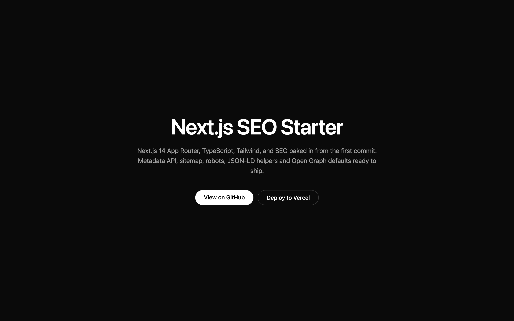

# Next.js SEO Starter

Opinionated Next.js 14 starter with SEO baked in from the first commit. Ship a site that ranks and shares well without fighting the framework.



**Live demo:** [nextjs-seo-starter.vercel.app](https://nextjs-seo-starter.vercel.app)

[](https://vercel.com/new/clone?repository-url=https%3A%2F%2Fgithub.com%2Fnazirabas%2Fnextjs-seo-starter)

## What's included

- **Next.js 14** App Router with the Metadata API wired for OG, Twitter cards, robots, canonical
- **TypeScript** strict mode
- **Tailwind CSS** 3 with a sensible base setup
- **Sitemap** auto-generated at `/sitemap.xml`
- **Robots** at `/robots.txt`
- **JSON-LD helpers** for Organization, Website, Breadcrumb, Article, FAQ and Product schemas
- **Single config file** at `src/app/lib/site.config.ts` for brand, URLs, socials and keywords
- No `powered-by` header, gzip compression, viewport theme color

## Quick start

```bash
git clone https://github.com/nazirabas/nextjs-seo-starter my-site
cd my-site
npm install
npm run dev
```

Then edit `src/app/lib/site.config.ts` with your brand details. Every metadata field pulls from there.

## Structure

```
src/app/
  layout.tsx        # Metadata API + JSON-LD in <head>
  page.tsx          # Home page
  globals.css       # Tailwind base
  sitemap.ts        # Auto sitemap
  robots.ts         # robots.txt
  lib/
    site.config.ts  # One place for brand/URL/socials
    seo.ts          # JSON-LD helpers
```

## Using the JSON-LD helpers

Drop into any page:

```tsx
import { articleJsonLd, faqJsonLd } from "@/app/lib/seo";

export default function Page() {
  const article = articleJsonLd({
    title: "My post",
    description: "A great post",
    url: "https://example.com/blog/my-post",
    image: "https://example.com/og.png",
    datePublished: "2026-01-15",
  });
  return (
    <>
      <script
        type="application/ld+json"
        dangerouslySetInnerHTML={{ __html: JSON.stringify(article) }}
      />
      <article>...</article>
    </>
  );
}
```

Available helpers: `organizationJsonLd`, `websiteJsonLd`, `breadcrumbJsonLd`, `articleJsonLd`, `faqJsonLd`, `productJsonLd`.

## License

MIT. Use it, fork it, ship with it.

---

Built by [Nazir Abbas](https://github.com/nazirabas). Web Developer and SEO Specialist for luxury brands.
